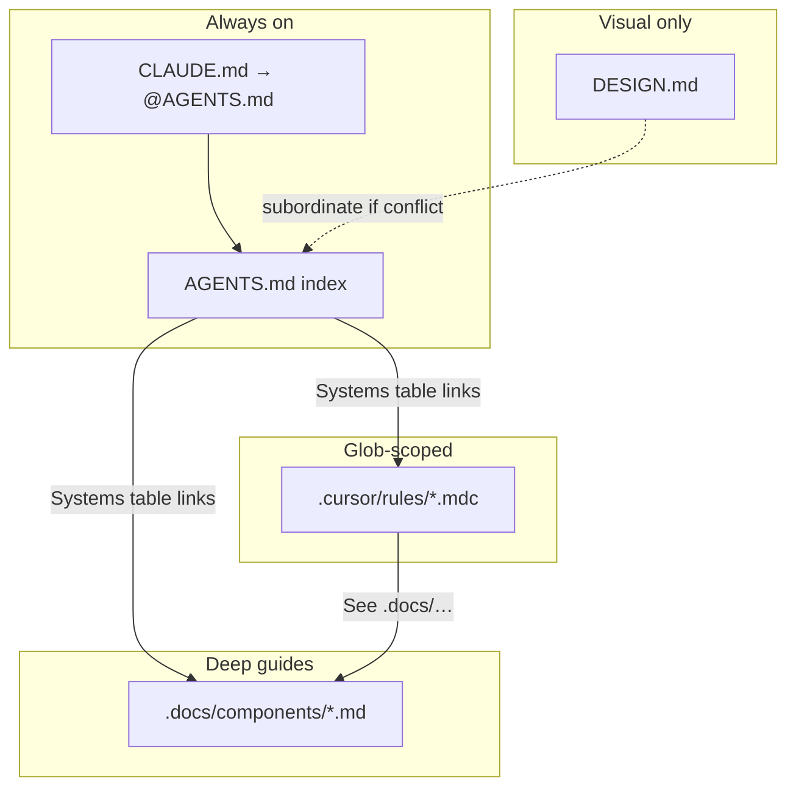

# Agent Rules Playbook

How this project organizes Cursor / Claude agent guidance — and how to reproduce the **same structure** in other repositories.

ERP-specific conventions in this repo (forms, tenancy, RBAC, etc.) are **examples of content**, not requirements for other apps. Transfer the **organization**, not the APIs.

---

## Purpose

Use this playbook when you want another codebase to get:

1. An always-on agent index (`AGENTS.md`)
2. Glob-scoped short rules (`.cursor/rules/*.mdc`)
3. Deep human + agent guides (`.docs/components/*.md`)
4. Clear precedence between architecture docs and visual design docs

At the bottom is a **Plan Mode prompt** you can paste into Cursor against a different repo (that agent does not need access to this one).

---

## File tree

```
AGENTS.md                 # Always-on index: systems table, hard conventions, do-not-invent
CLAUDE.md                 # Compatibility shim: @AGENTS.md only
DESIGN.md                 # Optional: visual style only (theme, type, spacing, surfaces)
.cursor/rules/*.mdc       # Glob-scoped short rules (alwaysApply: false)
.docs/components/*.md     # Deep guides paired with rules
docs/*.md                 # Domain / product docs (tenancy, ops) — not UI systems
```



---

## Layers and jobs

| Layer | Path | Job | Trigger |
|-------|------|-----|---------|
| Always-on index | `AGENTS.md` | Product framing, doc precedence, “before you write code”, systems index (doc ↔ rule), hard conventions, do-not-invent, canonical snippets, demos table, “adding a vertical” checklist | Always applied as project agent rules |
| Compatibility shim | `CLAUDE.md` | Single line: `@AGENTS.md` | Always |
| Visual SoT | `DESIGN.md` | Theme, typography, color, spacing, motion — **not** architecture | Referenced; loses to AGENTS on layout/interaction conflicts |
| Glob rules | `.cursor/rules/*.mdc` | Short must / must-not, path map, tiny ✅/❌ snippets, pointer to deep doc | Frontmatter `globs` + `alwaysApply: false` |
| Deep guides | `.docs/components/*.md` | When-to-use, folder map, quick start, conventions, related, mirror a canonical feature | Linked from AGENTS + matching rule |
| Domain docs | `docs/*.md` | Product concerns (ownership, roles, ops) that are not a shared UI system | Linked from AGENTS when needed |

---

## Precedence

1. **`AGENTS.md` + `.cursor/rules/` + `.docs/components/`** define architecture and behavior.
2. **`DESIGN.md`** defines visual style *within* those patterns.
3. If DESIGN suggests a layout or interaction that AGENTS forbids (e.g. detail routes, global search, parallel shells), **follow AGENTS**.

State this precedence explicitly in both `AGENTS.md` and `DESIGN.md` so agents do not “improve” the product by inventing forbidden shells.

---

## Pairing rule (1:1)

Every **system** in the AGENTS systems table should have:

- One row in the systems table (import / path | docs | rule)
- One short `.cursor/rules/<topic>.mdc`
- One deep `.docs/components/<topic>.md` (or a domain doc under `docs/` when it is not a UI system)

Short rule = **enforcement** when editing matching files.  
Deep doc = **teaching** (humans and agents).

Rule and doc filenames may differ slightly when the rule name is more specific than the doc (this repo’s examples):

| Rule (`.mdc`) | Doc (`.docs/components/`) |
|---------------|---------------------------|
| `dynamic-forms` | `forms.md` |
| `dynamic-table` | `tables.md` |
| `universal-modals` | `modals.md` |
| `feature-architecture` | `architecture.md` |
| `list-page-crud` | `list-pages.md` |
| `auth-rbac` | `auth.md` |
| same stem | same stem (`logging`, `testing`, `dashboards`, …) |

Always end the `.mdc` with `See .docs/components/<doc>.md`.

---

## `AGENTS.md` recipe

1. **Framing** — what the product is; prefer existing shared systems.
2. **Doc precedence** — architecture vs design (see above).
3. **Before you write code** — numbered steps (read the guide, mirror the canonical vertical, do not invent parallel stacks, …).
4. **Systems table** — one row per shared system: import/path | deep doc | rule file.
5. **Hard conventions** — bullets agents must not violate (error shape, auth gates, folder layout, …).
6. **Do not invent** — parallel stacks and anti-patterns called out by name.
7. **Canonical snippets** — tiny server/client examples of the happy path.
8. **Demos** — table of live routes/pages that *prove* each pattern.
9. **Adding a vertical** — checklist that reproduces the canonical feature folder.

Keep cross-cutting truth here. Do **not** dump every topic’s full how-to into `AGENTS.md`.

---

## `.mdc` rule recipe

```yaml
---
description: One-line when this rule matters
globs: path/globs/**/*,other/path/**
alwaysApply: false
---

# Title

Mirror **`canonical/path/`**. Do not invent X.

## Layout / Shape / Rules

| Concern | Path |
|---------|------|
| … | … |

- Short must / must-not bullets
- Tiny ✅ / ❌ snippets when a wrong shape is common

See `.docs/components/<same-topic>.md`.
```

**Guidelines**

- Prefer `alwaysApply: false` so topic rules fire only on relevant globs.
- Put always-true product law in `AGENTS.md`, not in fifteen always-on `.mdc` files.
- Name one **canonical** folder or route to mirror.
- Stay short (rough guide: ~20–110 lines). Move long how-tos to `.docs`.

---

## Deep doc recipe (`.docs/components/`)

1. **Title** + one-sentence job of the system
2. **Related** links to sibling docs
3. **When to use this** / when not to
4. **Folder map** — where code lives
5. **Quick start** — numbered steps with real code from the canonical vertical
6. **Conventions / constraints** — must / must-not
7. **Related files** and/or **live demo** route

Write for humans and agents. Duplicate the critical “do not invent” lines that the matching `.mdc` enforces.

---

## Authoring checklist (new system)

When you add or productize a shared system:

1. Implement (or identify) the canonical code path in the app.
2. Write `.docs/components/<topic>.md` (teaching).
3. Write `.cursor/rules/<topic>.mdc` with accurate `globs` (enforcement).
4. Add a row to the AGENTS **Systems** table.
5. Add hard-convention / do-not-invent bullets if the system changes global law.
6. Optionally add a **Demos** row (route that proves the pattern).
7. Update the “adding a vertical” checklist only if every new feature must touch this system.

---

## Anti-patterns

- **Fat always-on rules** — entire form/table guides in `alwaysApply: true` or a huge `AGENTS.md` with no deep docs.
- **Rules without docs** — short “do X” with no folder map or quick start for humans.
- **Docs without globs** — guides agents never see when editing the relevant files.
- **Design docs that redefine architecture** — `DESIGN.md` inventing detail pages, drawers-as-CRUD, or new shells.
- **Guidance that invents a second stack** — documenting a preferred library the codebase does not use.
- **No canonical vertical** — “follow best practices” instead of “mirror `src/features/<x>/`”.
- **Orphan systems** — a shared package with neither a systems-table row nor a rule.

---

## Key design choices to transfer (meta)

These are structural habits, not ERP requirements:

- Prefer existing shared systems; forbid parallel stacks in “Do not invent”.
- Stateless views; hooks (or equivalent) own state; thin routes.
- Name **one** canonical feature vertical to mirror.
- Glob-scoped rules stay short; deep docs hold the how-to.
- Architecture guidance beats design guidance on layout/interaction conflicts.
- Topic rules use `alwaysApply: false`; cross-cutting truth lives in `AGENTS.md`.

---

## Copy into Cursor Plan Mode

Paste everything inside the fence below into **Plan Mode** in another repository. That agent does not need this repo.

````markdown
# Plan: Agent rules pack for this repository

You are in **Plan Mode**. Do **not** create or edit files until I approve a plan. Research this workspace, then propose a concrete agent-rules pack that mirrors the *organization* below — adapted to **this** repo’s real stack and patterns.

## Goal

Propose (then later implement, after approval):

| Path | Role |
|------|------|
| `AGENTS.md` | Always-on agent index |
| `CLAUDE.md` | Shim containing only `@AGENTS.md` |
| `DESIGN.md` | Optional; visual style only. Create or split only if the repo already has (or clearly needs) a visual SoT separate from architecture |
| `.cursor/rules/*.mdc` | One short glob-scoped rule per shared system |
| `.docs/components/*.md` | One deep guide per shared system |
| `docs/*.md` | Only for domain/product topics that are not UI/component systems |

**Mirror the organization, not another product’s APIs.** Discover conventions from *this* codebase. Do not invent greenfield architecture, libraries, or folder layouts that are not already evidenced in the code (unless the repo is empty — then say so and ask).

## Method (research first)

Explore before drafting the plan:

1. **Stack** — language, framework, app router / package layout, test runner.
2. **Shared systems** — forms, modals/dialogs, tables/lists, errors, auth/RBAC, logging/audit, data access, design tokens, etc. List import paths that features already use.
3. **Canonical vertical** — pick one mature feature folder that new work should mirror. If several compete, prefer the most complete CRUD (or equivalent) example and note runners-up.
4. **Page / feature shape** — where state lives vs views vs routes; server vs client boundaries.
5. **Hard laws already enforced in code** — error result types, auth gates, tenancy, naming, export style.
6. **Existing agent docs** — if `AGENTS.md`, `.cursor/rules`, or similar already exist, plan to **extend/align** them rather than duplicate.

Do not propose rules that contradict working code. Encode what the repo already does.

## Target structure (required shape)

```
AGENTS.md
CLAUDE.md                 # @AGENTS.md only
DESIGN.md                 # optional visual SoT
.cursor/rules/<topic>.mdc
.docs/components/<topic>.md
docs/<domain>.md          # only if needed
```

### Precedence (put this in AGENTS and DESIGN)

- `AGENTS.md` + `.cursor/rules/` + `.docs/components/` = architecture and behavior.
- `DESIGN.md` = visual style within those patterns.
- If DESIGN conflicts with AGENTS on layout/interaction, **follow AGENTS**.

### Pairing (1:1)

Every system in the AGENTS systems table gets:

1. A systems-table row (import/path | docs | rule)
2. `.cursor/rules/<topic>.mdc` (`alwaysApply: false`, real `globs`)
3. `.docs/components/<topic>.md` (or `docs/` for non-UI domain topics)

Short rule = enforcement. Deep doc = teaching. End each `.mdc` with `See .docs/components/<doc>.md`.

### `AGENTS.md` sections (in order)

1. Framing (what this product/repo is; prefer existing shared systems)
2. Doc precedence
3. Before you write code (numbered)
4. Systems table
5. Hard conventions
6. Do not invent
7. Canonical snippets (tiny happy-path examples from *this* repo)
8. Demos (routes/pages/commands that prove each pattern)
9. Checklist for adding a feature / vertical (mirror the canonical folder)

### `.mdc` recipe

```yaml
---
description: One-line when this rule matters
globs: path/globs/**/*
alwaysApply: false
---

# Title

Mirror **`canonical/path/`**. Do not invent X.

## Layout / Rules
- Short must / must-not bullets
- Tiny ✅ / ❌ snippets when useful

See `.docs/components/<topic>.md`.
```

Keep rules short. Prefer `alwaysApply: false`. Cross-cutting law goes in `AGENTS.md`.

### Deep doc recipe

Title → related links → when to use → folder map → quick start with code from the canonical vertical → conventions → related files / live demo.

### Authoring habit to document in AGENTS

When adding a system later: deep doc + `.mdc` + systems-table row (+ optional demo) in the same change.

## Anti-patterns to avoid in the proposal

- Fat always-on topic rules or a novel-length `AGENTS.md` with no `.docs`
- Rules without docs, or docs with no matching globs
- Design guidance that redefines architecture (detail shells, parallel nav, new CRUD patterns)
- Documenting a second stack the codebase does not use
- No named canonical vertical
- Copying another product’s feature names, routes, or APIs into this repo’s rules

## Plan output (what to return)

Produce a plan that includes:

1. **Findings** — stack, canonical vertical path, list of shared systems discovered (with paths).
2. **File list** — exact paths to add or update (`AGENTS.md`, `CLAUDE.md`, each `.mdc`, each `.docs/components/*.md`, optional `DESIGN.md` / `docs/*`).
3. **Systems table draft** — markdown table: System | Import/path | Docs | Rule.
4. **For each rule** — proposed `globs`, one-line description, which canonical path to mirror.
5. **Hard conventions + Do not invent** — bullets grounded in this repo’s code.
6. **Demos table draft** — what proves each pattern in *this* app.
7. **Precedence statement** — architecture vs design.
8. **Migration notes** — what happens to any existing agent docs.
9. **Open questions** — only if the repo has no clear canonical vertical, or two incompatible patterns are both “official”; ask 1–2 critical questions instead of guessing.

After I approve, implement exactly that file set — content filled from this repo’s real patterns, not placeholders like “TODO: describe forms”.
````

---

## This repo’s pairing (reference)

For comparison when reading *this* boilerplate (not required by the prompt above):

| System | Rule | Doc |
|--------|------|-----|
| Feature architecture | `feature-architecture.mdc` | `architecture.md` |
| Auth / RBAC | `auth-rbac.mdc` | `auth.md` |
| Dynamic forms | `dynamic-forms.mdc` | `forms.md` |
| Modals | `universal-modals.mdc` | `modals.md` |
| Errors | `error-handling.mdc` | `error-handling.md` |
| DynamicTable | `dynamic-table.mdc` | `tables.md` |
| List-page CRUD | `list-page-crud.mdc` | `list-pages.md` |
| Workflow lists | `workflow-list-pages.mdc` | `workflow-list-pages.md` |
| Logging | `logging.mdc` | `logging.md` |
| Settings | `settings-pages.mdc` | `settings-pages.md` |
| Dashboards | `dashboards.mdc` | `dashboards.md` |
| Clock | `clock-pages.mdc` | `clock-pages.md` |
| Calendar | `calendar-pages.mdc` | `calendar-pages.md` |
| Testing | `testing.mdc` | `testing.md` |

Domain docs (not UI systems): [`organization-ownership.md`](./organization-ownership.md), [`organization-roles.md`](./organization-roles.md), [`operations.md`](./operations.md).
